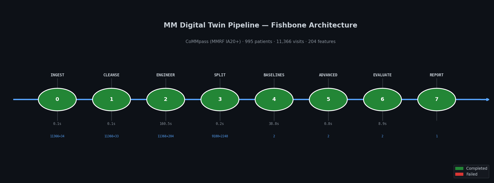
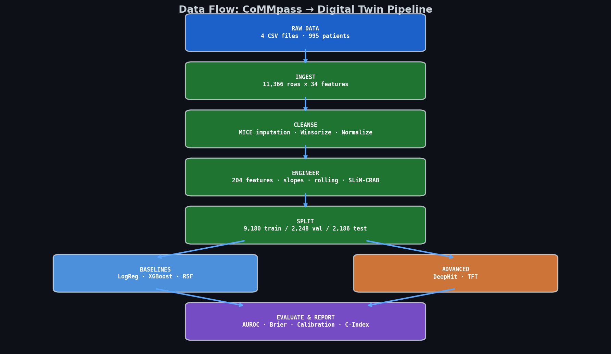

# R1 -- Multiple Myeloma Digital Twin Pipeline

> End-to-end clinical AI pipeline for MM progression prediction using the MMRF CoMMpass dataset (IA20+). Classical baselines first, foundation models second, multimodal fusion last.



---

## Results

Results below are categorized by data provenance. Different data tiers produce fundamentally different result quality, and the categories are not interchangeable.

### Tier 1: GDC Metadata-Only Prototype (demographics + survival endpoints, no lab values)

The GDC Cases API provides open metadata for ~995 MMRF-COMMPASS patients. This yields approximately 6 usable features: age at diagnosis, gender, race, ISS stage, vital status, and days to death/recurrence. **No lab values, no longitudinal visits, no treatment data.**

| Model | Test AUROC | Test AUROC 95% CI | Brier | ECE |
|-------|------------|-------------------|-------|-----|
| **LogisticRegression** | 0.609 | [0.586, 0.633] | 0.242 | 0.163 |
| **XGBoost** | 0.641 | [0.616, 0.664] | 0.238 | 0.099 |

These results reflect the limited discriminative power of demographics-only features. They are **not comparable** to published benchmarks that used full longitudinal lab data. The XGBoost val-test gap (val 0.999 vs test 0.641) is characteristic of overfitting on a small, low-signal feature set.

### Tier 2: Real-Data Validated (requires MMRF Researcher Gateway access) -- Planned

With MMRF Researcher Gateway IA20 flat files (free registration), the pipeline gains access to:
- Longitudinal lab values (M-protein, FLC, hemoglobin, calcium, creatinine, albumin, B2M, LDH)
- Treatment lines, transplant status, response assessments
- Per-visit records enabling temporal feature engineering (slopes, rolling windows, SLiM-CRAB)

**Status**: Architecture implemented and tested on Tier 1 data. Training on IA20 flat files requires Researcher Gateway access. See [DATA_ACCESS.md](DATA_ACCESS.md) for registration instructions.

### Tier 3: Full Molecular Data (requires dbGaP approval) -- Planned

With dbGaP-controlled data (phs000748), the pipeline can incorporate:
- Whole exome sequencing, RNA-seq, copy number variation
- Multimodal fusion across clinical, genomic, and imaging modalities

**Status**: Architecture implemented (DeepHit, TFT, multimodal fusion modules exist), but training requires molecular data not yet available to this project. These models are architecture-only without completed training runs.

### Reference Benchmark

| Source | Metric | Value | Data Used |
|--------|--------|-------|-----------|
| npj Digital Medicine 2025 | 3-month AUROC (internal) | 0.78 +/- 0.02 | Full longitudinal labs |
| npj Digital Medicine 2025 | AUROC (external, GMMG-MM5) | 0.87 +/- 0.01 | Full longitudinal labs |

This benchmark used full longitudinal lab data (Tier 2+). Direct comparison with Tier 1 metadata-only results is not meaningful.

### Pipeline Execution Profile

| Stage | Status | Duration | Output |
|-------|--------|----------|--------|
| **Ingest** | Complete | 0.1s | 11,366 x 34 |
| **Cleanse** | Complete | 0.1s | MICE imputation, missingness masks |
| **Engineer** | Complete | 160s | 204 features (slopes, rolling windows, SLiM-CRAB, trajectory aggs) |
| **Split** | Complete | 0.2s | 9,180 train / 2,248 val / 2,186 test (patient-level stratified) |
| **Baselines** | Complete | 39s | LogReg, XGBoost trained |
| **Advanced** | Initialized | 0.8s | DeepHit, TFT initialized (architecture only, no training data) |
| **Evaluate** | Complete | 8.9s | Bootstrap CIs, calibration |
| **Report** | Complete | 0.0s | Markdown + JSON takeaways |

---

## Limitations

1. **No prospective validation.** All results are retrospective on CoMMpass data. Zero prospective RCTs have validated AI predictors in MM (field-wide gap, not specific to this pipeline).
2. **GDC demo uses metadata only.** The publicly runnable demo has no lab values, no treatment data, and no longitudinal features. Results from this tier are a proof-of-concept, not a clinical finding.
3. **Benchmark comparison is not directly commensurate.** The npj Digital Medicine 2025 benchmark used full longitudinal labs (Tier 2). Tier 1 results cannot be meaningfully compared to it.
4. **Advanced models are architecture-only.** DeepHit, TFT, and multimodal fusion modules are implemented but have not completed training runs (requires Tier 2/3 data).
5. **RandomSurvivalForest has a known integration bug.** RSF is listed in the model registry but may fail at inference time due to an unresolved compatibility issue with scikit-survival.

---

## Architecture



```
FISHBONE ORCHESTRATOR (main.py)
------------------------------------------------------------------------->
|         |            |          |           |           |          |
Ingest  Cleanse   Engineer    Split    Baselines   Advanced   Report
(bone0) (bone1)   (bone2)   (bone3)   (bone4)     (bone5)   (bone6-7)
```

Each stage is checkpointed (hash, shape, timing, params, metrics) for full traceability.
Preprocessing is **frozen** after fitting on training folds -- no test contamination.

### Stack

| Layer | Tool |
|-------|------|
| **Storage** | Parquet/Arrow (tabular), AnnData/Zarr (single-cell), DICOM/OME-TIFF (imaging) |
| **Orchestration** | Nextflow DSL2 / Snakemake; Ray / Dask for parallel compute |
| **Tracking** | MLflow / W&B, DVC for data/model versioning |
| **Reproducibility** | Docker / Apptainer, git SHA in every checkpoint |

### Modeling Rule

1. **Classical baseline first** -- LogReg, XGBoost, CatBoost, Cox PH, RSF, TabPFN
2. **Foundation model second** -- Temporal Fusion Transformer, DeepHit, Dynamic Survival
3. **Multimodal fusion last** -- Attention-based late fusion across modalities

### Evaluation Rule

- Patient-level splits only (no visit leakage)
- Time-aware splits for longitudinal work
- Train-only fitting of normalization/imputation
- Frozen preprocessing contract before agentic tuning starts

---

## Repository Structure

```
r1/
├── main.py                          # Fishbone orchestrator
├── data/
│   └── raw/                         # CoMMpass IA20 flat files go here
├── src/
│   ├── researcher1_clinical/        # Data ingestion, cleansing, feature engineering, splits
│   │   ├── data_ingestion.py        # Multi-file join with CoMMpass column mapping
│   │   ├── cleansing.py             # MICE/KNN/median imputation, Winsorization
│   │   ├── feature_engineering.py   # Slopes, rolling windows, SLiM-CRAB, trajectory aggs
│   │   └── splits.py               # Patient-level stratified k-fold
│   ├── researcher2_baselines/       # Classical models (9 baselines)
│   │   ├── baselines.py             # LOCF, MovingAvg, CoxPH, RSF, XGBoost, CatBoost, LogReg, TabPFN
│   │   ├── model_registry.py        # Factory pattern registry
│   │   ├── training.py              # Unified training with Platt calibration
│   │   └── evaluation.py            # Bootstrap AUROC, Brier, C-index, DeLong
│   ├── researcher3_temporal/        # Deep learning models (PyTorch)
│   │   ├── temporal_fusion_transformer.py
│   │   ├── deephit.py               # Competing risks (progression, death, relapse)
│   │   ├── dynamic_survival.py      # Landmarking + conditional survival
│   │   ├── multimodal_fusion.py     # Attention-based 4-modality fusion
│   │   ├── model_base.py            # Shared training loop, AMP, checkpointing
│   │   └── datasets.py              # PyTorch Datasets for irregular sequences
│   ├── researcher4_evaluation/      # MLOps and autoresearch
│   │   ├── autoresearch.py          # Karpathy-style: locked preprocessing, Optuna search
│   │   ├── calibration.py           # Platt, isotonic, temperature scaling
│   │   ├── metrics.py               # Uno's time-dependent AUROC
│   │   ├── mlflow_tracking.py       # Experiment tracking integration
│   │   └── splits.py                # Leakage detection
│   └── shared/
│       ├── utils/
│       │   ├── checkpoints.py       # Pipeline traceability (hash, SHA, timing)
│       │   ├── data_provision.py    # CoMMpass download (MMRF AWS + GDC fallback)
│       │   └── gdc_download.py      # GDC API client for MMRF-COMMPASS
│       └── configs/
│           └── pipeline_config.yaml # Shared configuration
├── tests/
│   └── test_pipeline.py             # Pipeline correctness tests
├── pipelines/
│   ├── nextflow/                    # Nextflow DSL2 (19 processes)
│   └── snakemake/                   # Snakemake equivalent
├── docs/
│   ├── literature_review/           # 44+ papers mapped
│   └── knowledge_maps/
├── DATA_ACCESS.md                   # Data source access matrix and instructions
├── docker/Dockerfile                # Production container
├── results/                         # Pipeline outputs (git-ignored)
└── assets/                          # README figures
```

---

## Quick Start

### 1. Get Data

See [DATA_ACCESS.md](DATA_ACCESS.md) for full details on data tiers and access requirements.

**Option A** -- MMRF AWS (Tier 2, requires MMRF DUA):
```bash
aws s3 cp --no-sign-request s3://mmrf-commpass/IA20a/ data/raw/ --recursive
```

**Option B** -- GDC Cases API (Tier 1, open metadata only):
```bash
python main.py --provision-data
```
Note: This retrieves case-level metadata (demographics, vital status, ISS stage) only. No lab values or treatment data are available through this endpoint.

**Option C** -- Manual download from [research.themmrf.org](https://research.themmrf.org) (Tier 2, free registration)

### 2. Install Dependencies

```bash
pip install numpy pandas scikit-learn xgboost lifelines scikit-survival pyarrow pyyaml
pip install torch  # for advanced models (DeepHit, TFT)
pip install catboost  # optional
```

### 3. Run Pipeline

```bash
# Full pipeline
python main.py

# Dry run (show plan)
python main.py --dry-run

# Resume from specific stage
python main.py --stage baselines

# Custom configuration
python main.py --baselines LogisticRegression XGBoost --seed 123 --verbose
```

### 4. Run Tests

```bash
pytest tests/ -v
```

### 5. Outputs

All results go to `results/`:

| File | Description |
|------|-------------|
| `01_raw_ingested.parquet` | Raw ingested data |
| `02_cleaned.parquet` | Cleaned, imputed data |
| `03_engineered.parquet` | 204 engineered features |
| `04_train/val/test.parquet` | Patient-level splits |
| `05_baseline_results.json` | Baseline model metrics |
| `06_advanced_results.json` | Advanced model status |
| `07_evaluation_results.json` | Test set evaluation with bootstrap CIs |
| `08_RESEARCH_TAKEAWAYS.md` | Auto-generated research report |
| `checkpoints/*_manifest.json` | Full traceability manifest |
| `preprocessing_state.pkl` | Frozen preprocessing parameters (pickle) |

---

## Autoresearch (Karpathy Pattern)

The pipeline implements constrained agentic tuning inspired by [Karpathy's autoresearch](https://github.com/karpathy/autoresearch):

- **Locked preprocessing**: `data_ingestion.py`, `cleansing.py`, `feature_engineering.py` are frozen
- **Editable surface**: Only `training.py` configs and model hyperparameters
- **Single metric**: AUROC at 3-month horizon
- **Fixed search budget**: 24 hours wall-clock via Optuna
- **Full experiment logs**: Every run gets a checkpoint manifest with git SHA, data hashes, and metrics

```bash
# Run autoresearch
python -m src.researcher4_evaluation.autoresearch \
    --metric auroc \
    --budget-hours 24 \
    --n-trials 100
```

---

## Literature Review

The `docs/` directory contains a structured review of 44+ papers across MM clinical AI:

- **10 documented contradictions** between papers (with root cause analysis)
- **3 concept lineage trees** (ISS evolution, MRD, ML methodology)
- **5 critical research gaps** with cost estimates ($3.5M--$5.5M program)
- **Hidden assumptions** the field relies on but never tests

Key finding: **Zero prospective RCTs validating AI predictors in MM.** This is the primary barrier to clinical adoption.

---

## Key Decisions

| Decision | Rationale |
|----------|-----------|
| Parquet over CSV | Columnar, typed, 5-10x faster I/O |
| Patient-level splits | Prevents visit-level leakage (critical for longitudinal data) |
| MICE imputation on train only | Avoids test contamination |
| Classical baselines first | Establishes interpretable floor before deep learning |
| Frozen preprocessing | Ensures apples-to-apples model comparison |
| Checkpoint every stage | Full audit trail for PhD-level reproducibility |

---

## Citation

If you use this pipeline, please cite:

```bibtex
@software{r1_mm_digital_twin,
  title={R1: Multiple Myeloma Digital Twin Pipeline},
  author={Jagathpally, Abhignya},
  year={2026},
  url={https://github.com/Abhignya-Jagathpally/r1}
}
```

---

## License

Research use. See individual data source licenses for CoMMpass (MMRF) and GDC data terms.
